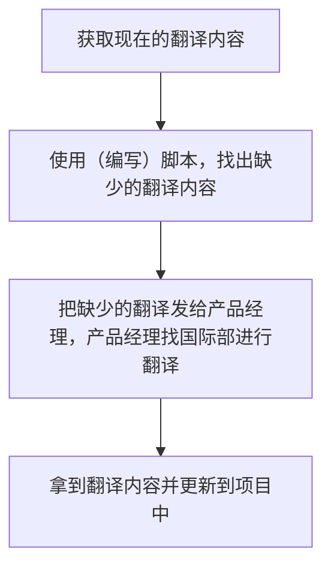
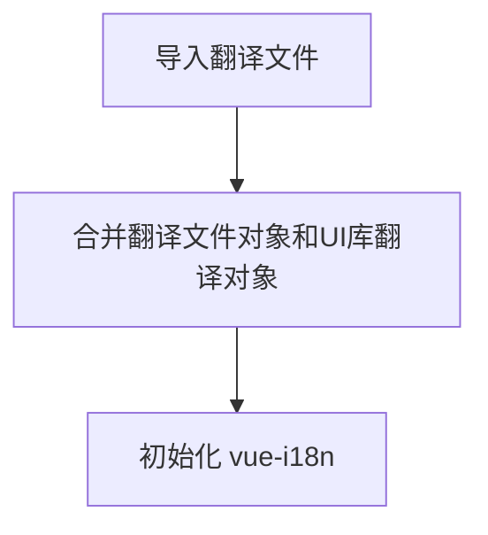

# 多语言处理总结

## 背景

由于公司的业务范围不仅仅包含大陆地区，还包括了各种和其他厂家合作的 OEM 项目，有些厂家在台湾或者国外。所以有进行多语言处理的必要，为了保证以后的开发效率，避免重复劳动，降低 Bug 数量，根据最近完成的几个多语言相关项目编写这篇总结文档。

## 原理

### 翻译获取流程

流程如下：



在完成这个流程之后，就需要在不同的项目中进行 i18n 和 l10n 的处理。

**注意：** 由于国际部并不清楚翻译的使用场景，因此有的时候翻译并不完全契合使用场景（比如用在表格头或者按钮中但没有简写），此时最好找产品经理或国际部进行翻译更新。

### 各项目处理方式

#### ngconsole

##### 关于翻译资源的文件

ngconsole 的翻译存储在和 ngconsole 目录处于同一个目录的 ngconsole_resources 的对应目录下：

- 中文版：`zh-cn\\{code,lang}.json`
- 英文版：`en\\{code,lang}.json`
- 台湾版：`zh-tw\\{code,lang}.json`

直接由前端使用的翻译存储在 **lang.json**中，后端返回错误码时也需要进行报错，对应于错误码的翻译则存储在 **code.json** 中。

**注意：** 在修改翻译文件之前，由于翻译文件行数特别多，出现冲突很容易合漏，所以最好先拉取变更再修改！

##### 在模板中使用翻译

模板中的翻译主要依靠 `localize` 等指令（js\\vdi\\i18n\\index.js）实现，比如下面的对应关系：

```html
<span
	ng-if="row.updatetype === 1 && [1, 2].includes(row.updatestatus)"
	localize="{1}下发中{2}{3}/s{4}/s"
	param1="{{ row.updatedesktopname }}"
	param2="{{ row.progress }}"
	param3="{{ row.downspeed ? (row.downspeed | voiFileSize : 'KB' : 2 : ['KB', 'MB']) : '0KB' }}"
	param4="{{ row.upspeed ? (row.upspeed | voiFileSize : 'KB' : 2 : ['KB', 'MB']) : '0KB' }}">
</span>
```

```json
{
	"{1}下发中{2}{3}/s{4}/s": "当前场景：{{1}}<br/>下发中...{{2}}%<br/>↓{{3}}/s <span style='margin-left:10px;'>↑{{4}}/s</span>"
}
```

##### 在 JavaScript 中使用翻译

只需要注入 `i18n`，然后调用`translate(text)`方法就可以获取到翻译之后的文本，下面是带参数 key 的调用方式：

```js
app.module('test').controller('Test', function($scope, i18n){
	const translated = i18n.translate("{1}下发中{2}{3}/s{4}/s", '模板', 'b', 'c', d)
})
```

默认情况下，`translate`可以获取到预期结果，但如果刚好 `lang.json` 中的 key 和`code.json`中的 key 冲突，则应该视需要手动调用`translateCode`或者`translateText`。

#### TSpace

TSpace 主要由 Vue2 编写，具有比较现代化的 i18n 框架：[开始 | Vue I18n (kazupon.github.io)](https://kazupon.github.io/vue-i18n/zh/started.html#javascript)，可以和各种库进行集成。

##### 翻译文件位置和引入

和 ngconsole 中不同，Vue 用 js 对象存储翻译内容，大概格式如下：

```json5
module.exports = {
  ticket_create_at: 'The Time of Creating the Application Form',
  // ...
  ErrorCodes: {
    101: 'Resource pool not found'
    // ...
  },
  TemplateStatus: {
    alive: 'Normal',
    // ...
  }
}

```

由于 Tspace 使用了一些组件库，所以如果引入组件库则需要考虑和 vue-i18n 集成的问题，下面同时引入了 iView 和 elementUI：

```js
import iView_zh_CN from 'view-design/dist/locale/zh-CN'
import iView_en from 'view-design/dist/locale/en-US'
import iView_zh_TW from 'view-design/dist/locale/zh-TW'
import zh_CN from './zh-cn'
import zh_TW from './zh-tw'
import en from './en'
import Vue from 'vue'
import ViewUI from 'view-design'
import VueI18n from 'vue-i18n'
import element_en from 'element-ui/lib/locale/lang/en'
import ElementLocale from 'element-ui/lib/locale'

Vue.use(ViewUI)
Vue.use(VueI18n)

const messages = {
  'zh-cn': Object.assign(iView_zh_CN, zh_CN),
  zh: Object.assign(iView_zh_CN, zh_CN), // 兼容部分谷歌的navigator.language==='zh'
  'zh-tw': Object.assign(iView_zh_TW, zh_CN, zh_TW),
  en: Object.assign(iView_en, en, element_en)
}

const i18n = new VueI18n({
  locale: sessionStorage.getItem('lang') || navigator.language.toLowerCase() || 'en', // 语言标识(zh-cn/zh-tw/en),根据当前浏览器的语言进行切换
  messages,
  silentTranslationWarn: true
})
ViewUI.i18n((key, value) => i18n.t(key, value))
ElementLocale.i18n((key, value) => i18n.t(key, value))

export default i18n
```

执行流程如下：



##### 调用方法

翻译 API 的调用方法比较统一

```Vue
<template>
	<p>
		{{$t('to_translate')}}
	</p>
</template>

<script>
export default {
	methods: {
		test () {
			this.$t('to_translate')
		}
	}
}
</script>
```

#### UAA 平台

UAA 平台用的是 admin 框架 [Bootstrap Admin &amp; Dashboard Template · CoreUI](https://coreui.io/)，从项目结构来看处理翻译和 Tspace 几乎一致。

## 问题与边界情况

### 翻译遗漏

#### ngconsole

##### 星期的翻译

> js\\vdi\\scheduler\\controllers.js

源码中对星期的翻译比较 tricky，属于动态拼接翻译的 key，翻译的时候要留意是否遗漏：

```js
$scope.dates.push({
	name: '周' + '日一二三四五六'[dayDate.getDay()]
})
```

##### 模板中的拼接字段

> 1. js\\vdi\\template\\controller.fuse.js
> 2. js\\vdi\\utils\\ui.js
> 3. js\\vdi\\template\\controller.teach.js
> 4. js\\vdi\\template\\controller.person.js

由于历史原因，这些拼接的字段**并没有**对其中的中文部分调用`translate`，所以可能会导致翻译遗漏：

```js
// 中文版
let label = `${tmpl.name} (${tmpl.cpu_num}核 /${tmpl.memory_mb / 1024}G /${tmpl.system_gb}G `

// 英文版
$scope.props = {
	_: function(s) {
		return i18n.translate(s)
	}
}
let label = `${tmpl.name (${tmpl.cpu_num}${$scope._('核')}/${tmpl.memory_mb / 1024}G  /${tmpl.system_gb}G `
```

##### zy-table 配置错误

这可能会导致表头缺失翻译。

```js
// 错误方式
$scope.props = {
	_: function(s) {
		return s
	}
}

// 正确方式
$scope.props = {
	_: function(s) {
		return i18n.translate(s)
	}
}
```
